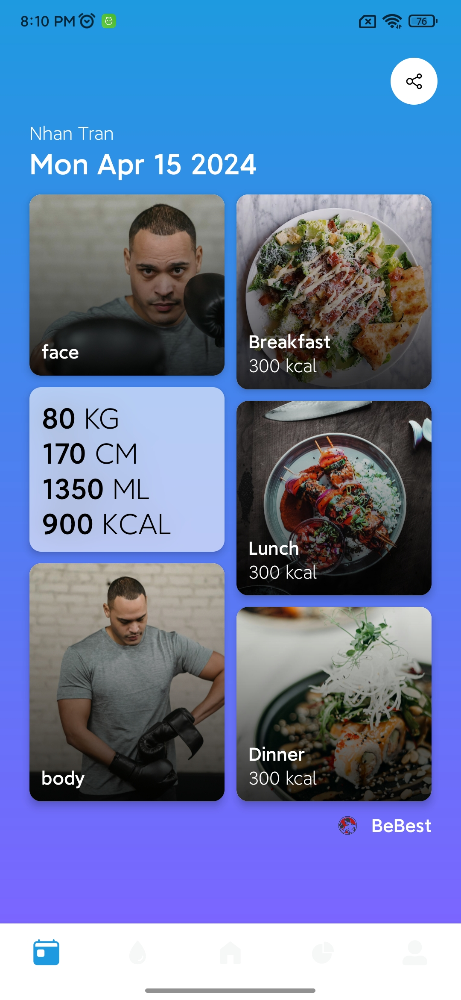
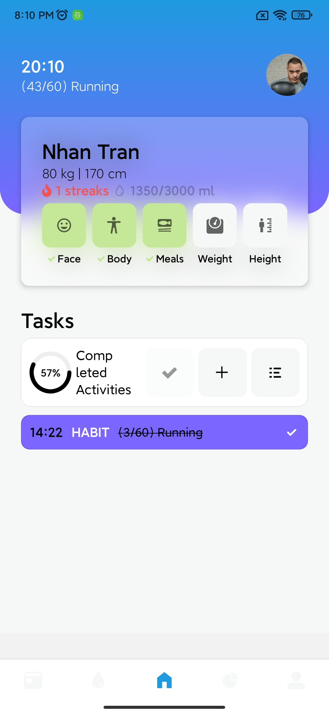
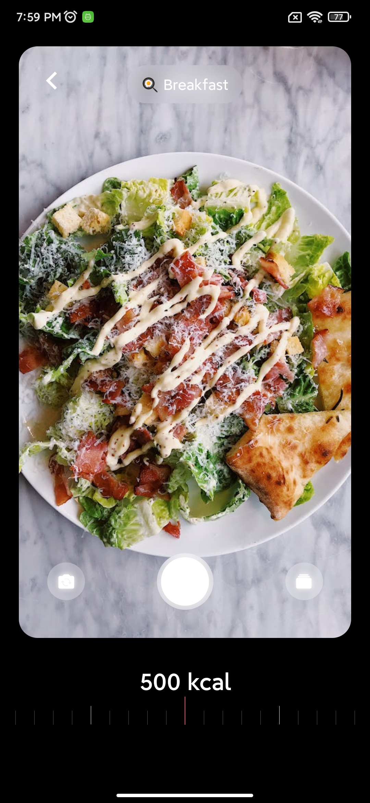
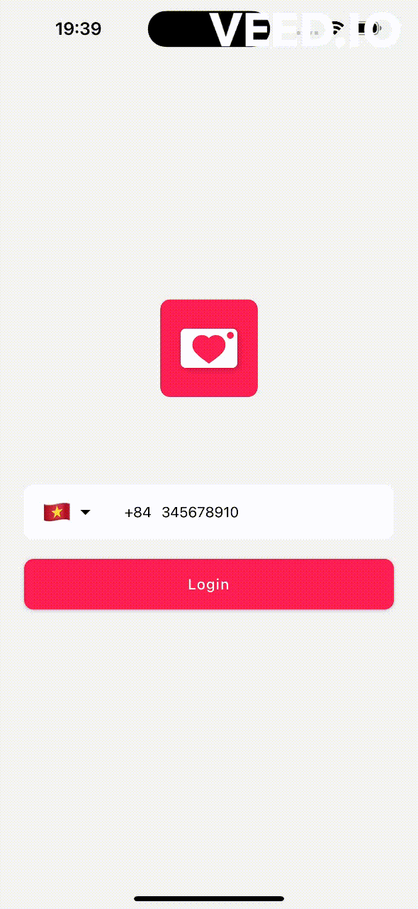

# Track and capture your body, face, meal images and anaylyst everyday

This is a React Native Tracker, help you track your lose weight process.
Additional features:

- [Expo Router](https://docs.expo.dev/routing/introduction/) file-based navigation and API Routes
- [Firebse](https://firebase.google.com/) for authentication, database, image stored.
- [React Native Vision Camera](https://github.com/mrousavy/react-native-vision-camera) build camera in app for capture image
- [Zuntand](https://redux.js.org/introduction/getting-started) and [MMKV](https://github.com/mrousavy/react-native-mmkv) for state management
- [React Native Chart Kit](https://expo.dev/@indiespirit/react-native-chart-kit) for charts
- [Reanimated](https://docs.swmansion.com/react-native-reanimated/) 3 and [Moti](https://moti.fyi/) for animations
- [Gesture Handler](https://docs.swmansion.com/react-native-gesture-handler/) for gestures

## Screenshots

## Demo

